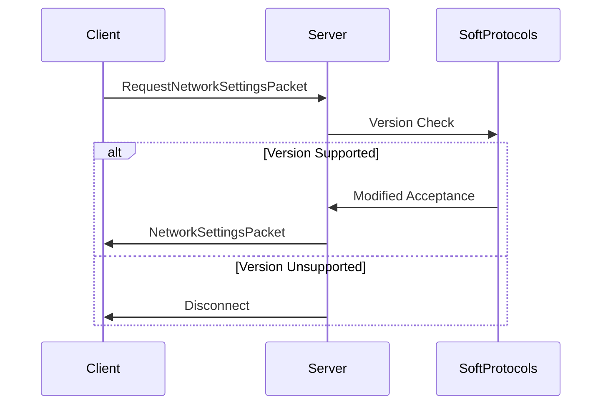

<div align="center">
<h1>🌐 SoftProtocols - Protocol Version Compatibility Plugin</h1>

<p align="center">
A lightweight PocketMine-MP plugin that <strong>exclusively handles protocol version compatibility</strong> during the initial handshake, allowing players with slightly different Minecraft versions to connect while maintaining all other packet behaviors unchanged.

[](https://poggit.pmmp.io/p/SoftProtocols) [](https://poggit.pmmp.io/p/SoftProtocols) [](https://poggit.pmmp.io/p/SoftProtocols) [](LICENSE) [](https://discord.gg/EEJK2vxtCp) 

</p>

</div>

---

## 🚀 Key Feature

> [!WARNING]
> **Protocol Handshake Only**  
> This plugin only modifies the version negotiation process during the **initial handshake**.  
> It does **not** touch gameplay packets, compression, or encryption.

---

## 🧩 Supported Protocol Versions

| Protocol | Minecraft Version     | Notes             |
|----------|------------------------|-------------------|
| 818      | 1.21.90 – 1.21.92      | Primary Supported |
| 819      | 1.21.93                | Minor Extension   |

---

## ⚙️ How It Works

1. Intercepts only the `RequestNetworkSettingsPacket` (handshake)
2. Validates against configured protocol versions
3. Modifies **only the version check** while keeping:
   - All other packet handling intact
   - Original compression settings
   - Standard encryption flow
   - Unchanged gameplay behavior



---

## 📥 Installation

1. Download the latest `SoftProtocols.phar`
2. Place it inside your `/plugins/` folder
3. Restart your PocketMine-MP server

---

## 📌 Important Notes

> [!IMPORTANT]
> ⚠ This is **not a full version compatibility layer**
> SoftProtocols does **not** handle:
>
> * Packet structure changes
> * Gameplay mechanics or feature parity
> * Block/entity/item remapping

> [!TIP]
> ✅ Recommended Use Case:
>
> * For minor version differences (e.g., 1.21.90 ↔ 1.21.93)
> * When client/server features are almost identical

---

## 🛠 Configuration

No config file needed.
Edit the supported protocols directly in `SoftProtocols.php`:

```php
public const SUPPORTED_PROTOCOLS = [
    818,  // Original version
    819   // Newer compatible version
    // Add ONLY minor version differences
];
```

---

## 🧑‍💻 Need Help?

If you're experiencing issues, please open a GitHub issue and include:

* Minecraft client version
* PocketMine-MP version
* Console output or crash log (if any)